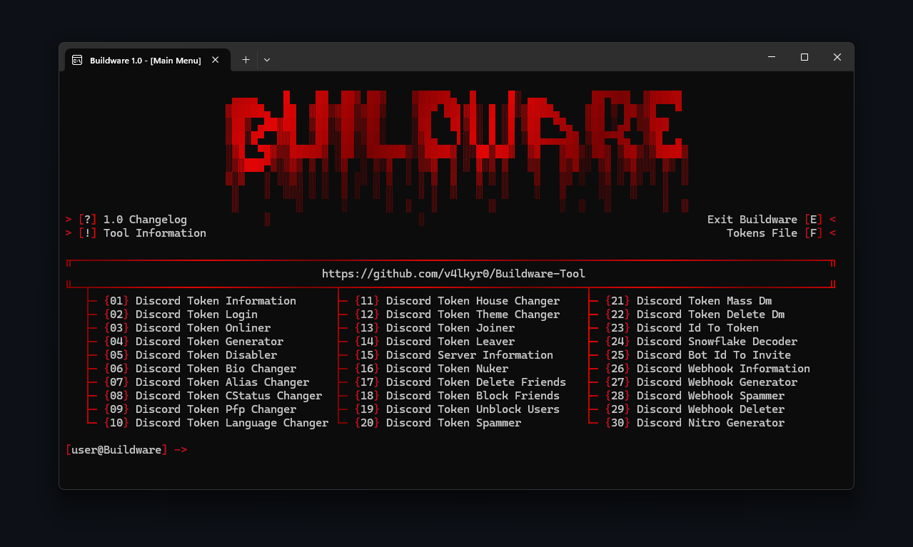

<!-- <div align="center">

#  Buildware-Tool 

<p>
  <strong>All-in-one Discord utility suite for tokens, webhooks & bots</strong>
</p>

<p>


</p>



</div>

<br>

---

## Warning

**DO NOT** download Buildware-Tool from unofficial sources. **Only use** this official Github repository to avoid malware, scams, or compromised versions. 

<br>

---

## About

**Buildware-Tool** is a Discord API Tool created by **myself (v4lkyr0)**. It comes with many features for **tokens, webhooks, bots**, and more. **All in one place**! The tool works on **Windows & Linux**, and you don't have to worry about **malware or any other bad stuff**. Buildware-Tool will be **updated regularly**, so stay tuned and **enjoy**! :D

<br>

---

## Features

```yaml
- Changelog        : Displays the change history.
- Exit Buildware   : Exits the tool.
- Tool Information : Displays information about the tool.
- Tokens File      : Open the tokens file.
```

```yaml
- Discord Token Information      : Displays sensitive information about a token.
- Discord Token Login            : Log in to Discord using a token.
- Discord Token Onliner          : Set a token's status to online.
- Discord Token Generator        : Generates random token.
- Discord Token Disabler         : Disables a token.
- Discord Token Bio Changer      : Changes the account's bio.
- Discord Token Alias Changer    : Changes the account's display name.
- Discord Token CStatus Changer  : Changes the custom status of the account.
- Discord Token Pfp Changer      : Changes the account's profile picture.
- Discord Token Language Changer : Changes the Discord interface language.
- Discord Token House Changer    : Changes the HypeSquad house of the account.
- Discord Token Theme Changer    : Changes Discord’s theme.
- Discord Token Joiner           : Makes a token join a server.
- Discord Token Leaver           : Makes a token leave a server.
- Discord Server Information     : Shows detailed information about a server.
- Discord Token Nuker            : Performs destructive actions on the account.
- Discord Token Delete Friends   : Deletes all friends from the account.
- Discord Token Block Friends    : Blocks all friends from the account.
- Discord Token Unblock Users    : Unblocks all blocked users.
- Discord Token Spammer          : Sends mass messages in a channel.
- Discord Token Mass Dm          : Sends mass private messages.
- Discord Token Delete Dm        : Deletes all private messages.
- Discord Id To Token            : Tries to brute force from a user ID.
- Discord Snowflake Decoder      : Decodes a Discord ID.
- Discord Bot Id To Invite       : Gets an invitation link from a bot's ID.
- Discord Webhook Information    : Shows information about a webhook.
- Discord Webhook Generator      : Generates webhooks.
- Discord Webhook Spammer        : Spams a webhook with messages.
- Discord Webhook Deleter        : Deletes a webhook.
- Discord Nitro Generator        : Generate random Discord Nitro codes.
```

<br>

---

## Installation

[Download the latest Buildware-Tool version here](https://github.com/v4lkyr0/Buildware-Tool/archive/refs/heads/Buildware-Tool.zip)

<p>

```
1. Download the .zip folder.
2. Unzip the folder.
3. Run "Setup.py".
4. Enjoy!
```
**Or via Git:**
```
1. Open a terminal.
2. Type: git clone https://github.com/v4lkyr0/Buildware-Tool.git
3. Type: cd Buildware-Tool
4. Type: git pull
5. Type: "python Setup.py" or "python3 Setup.py"
6. Enjoy!
```

<br>

---

## Requirements

- **Python 3.8 or higher.**
- **Windows or Linux OS.**
- **Internet connection.**

<br>

---

## Donation

```yaml
- Ethereum : 0xef1d65ff652e9087ebd7af400122caebb35fdf2b
- Solana   : EqVkGSpgj2DZHN9wkKqzG9zTTiaQmMpkSuLeBynqLzbj
```

<br>

---

## Disclaimer

> **Buildware-Tool is strictly for educational & security research purposes.**
>
> - Use this tool **only on your own** token, bots, and servers.
> - Any malicious or unauthorized use is **prohibited & illegal**.
> - Using this tool may **violate Discord's Terms of Service**.

> - I am **not responsible** for misuse.
 -->
